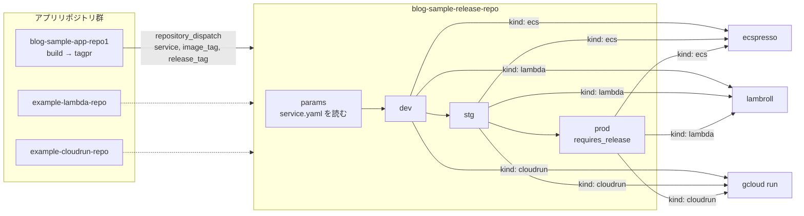

# blog-sample-release-repo

複数のサービスを、それぞれのデプロイ方式 (ECS / Lambda / Cloud Run) で環境ごとにデプロイするためのリリースリポジトリです。
各アプリリポジトリはイメージをビルドして `repository_dispatch` を送るだけで、**デプロイ定義とデプロイの実行はすべてこのリポジトリが持ちます**。

## 考え方

- **サービス = ディレクトリ**: `services/<name>/service.yaml` にデプロイ方式 (`kind`) と環境ごとの接続先を書く。サービスの追加はディレクトリを 1 つ足す PR で済み、GitHub 側の設定変更は不要。
- **デプロイ方式はプラグイン**: `.github/actions/deploy-<kind>/` が 1 方式を担当する。`deploy.yml` はマニフェストの `kind` を見て振り分けるだけ。
- **環境の進み方は共通**: dev → stg → prod の順。マニフェストに無い環境はスキップし、`requires_release: true` の環境は release タグ付きの dispatch でだけ進む。前段が失敗したら後段には進まない。
- **どこでも同じイメージ**: 全環境で同じイメージタグ (`sha-<commit>`) を使う。再ビルドはしない。



## ディレクトリ構成

```
.
├── services/
│   ├── blog-sample-app/            # kind: ecs (実サービス)
│   │   ├── service.yaml
│   │   └── ecspresso/              # config.yaml, ecs-task-def.json, ecs-service-def.json
│   ├── example-lambda/             # kind: lambda (例)
│   │   ├── service.yaml
│   │   └── lambroll/function.json
│   └── example-cloudrun/           # kind: cloudrun (例)
│       ├── service.yaml
│       └── cloudrun/service.yaml
├── scripts/render.sh               # 定義をダミー値でレンダリング (CI / ローカル共用)
└── .github/
    ├── actions/
    │   ├── deploy-ecs/             # ecspresso verify / diff / deploy
    │   ├── deploy-lambda/          # lambroll diff / deploy
    │   └── deploy-cloudrun/        # envsubst → gcloud run services replace
    └── workflows/
        ├── release.yml             # repository_dispatch を受けて dev → stg → prod
        ├── deploy.yml              # 再利用: 1 サービス × 1 環境 (kind で振り分け)
        ├── rollback.yml            # 手動: 任意タグの再デプロイ
        └── ci.yml                  # PR: 全サービス × 全環境の render
```

## service.yaml

```yaml
name: blog-sample-app
kind: ecs                    # ecs | lambda | cloudrun
source: gainings/blog-sample-app-repo1

image:
  registry: 111111111111.dkr.ecr.ap-northeast-1.amazonaws.com
  repository: blog-sample-app

environments:                # dev → stg → prod の順。無い環境はスキップ
  dev:
    aws:                     # kind が ecs / lambda の場合
      region: ap-northeast-1
      account_id: "111111111111"
      role_arn: arn:aws:iam::111111111111:role/gha-release-blog-sample-app-dev
    vars:                    # デプロイ定義のテンプレートに環境変数として渡される
      TARGET_GROUP_ARN: ...
  prod:
    requires_release: true   # release_tag 付きの dispatch でだけデプロイ
    aws: { ... }
    vars: { ... }
```

Cloud Run の場合は `aws` の代わりに `gcp` (`project_id`, `region`, `workload_identity_provider`, `service_account`) を書きます。

デプロイ定義側では、`IMAGE`, `ENV`, `AWS_REGION`, `AWS_ACCOUNT_ID` と `vars` の各キーが環境変数として使えます。ecspresso / lambroll では `{{ must_env `IMAGE` }}`、Cloud Run の `service.yaml` では `${IMAGE}` と書きます。

## デプロイ方式ごとの動き

| kind | ツール | 認証 | 実行内容 |
|---|---|---|---|
| `ecs` | [ecspresso](https://github.com/kayac/ecspresso) | AWS OIDC | `verify` → `diff` → `deploy` (サービス安定化まで待機。サーキットブレーカーで自動ロールバック) |
| `lambda` | [lambroll](https://github.com/fujiwara/lambroll) | AWS OIDC | `diff` → `deploy` (コンテナイメージ。新バージョンを publish してエイリアスを付け替え) |
| `cloudrun` | gcloud | GCP Workload Identity | `envsubst` で `service.yaml` を埋めて `gcloud run services replace` (新リビジョンが Ready になるまで待機) |

新しい方式を足すときは `.github/actions/deploy-<kind>/action.yml` を追加し、`deploy.yml` に分岐を 1 つ足します。

## 起動方法

### repository_dispatch (通常)

アプリリポジトリから GitHub App のトークンで送ります。

```json
{
  "event_type": "deploy",
  "client_payload": {
    "service": "blog-sample-app",
    "image_tag": "sha-0123abcd...",
    "release_tag": "v2026.0920.0",
    "sha": "0123abcd...",
    "source_run_url": "https://github.com/.../actions/runs/..."
  }
}
```

`release_tag` が空なら `requires_release` の環境 (通常は prod) はスキップされます。

### 手動

- `Release` ワークフローの `workflow_dispatch`: 同じ引数で通しのデプロイを実行します。
- `Rollback / Redeploy`: サービス、環境、イメージタグ (`sha-...` または `vYYYY.MMDD.N`) を指定して再デプロイします。

## セットアップ

### クラウド側 (このリポジトリの範囲外)

各サービス・環境のリソース (ECS クラスター、ALB、IAM ロール、Lambda 実行ロール、Cloud Run のサービスアカウント等) は Terraform 等で用意し、その ID や ARN を `service.yaml` に書きます。

GitHub Actions 用のロールは **このリポジトリの環境を信頼する** ように設定します。
AWS の OIDC なら `sub` を `repo:gainings/blog-sample-release-repo:environment:<env>` に、GCP の Workload Identity なら属性条件を同様に絞ります。

### GitHub 側

- **Environments** `dev` / `stg` / `prod` を作成します。変数の設定は不要です (値はすべて `service.yaml` にあります)。`prod` に Required reviewers を設定すると、承認を挟んでから本番デプロイできます。
- **GitHub App**: アプリリポジトリが dispatch に使う GitHub App をこのリポジトリにもインストールします (Contents: Read and write)。

## ローカルでの確認

```sh
scripts/render.sh blog-sample-app dev
scripts/render.sh example-lambda prod
scripts/render.sh example-cloudrun dev
```

`yq`, `ecspresso`, `lambroll`, `envsubst` が必要です。クラウドには接続しません。
