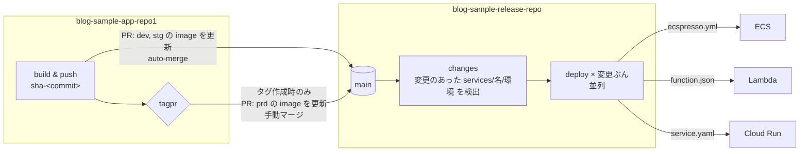

# blog-sample-release-repo

複数のサービスを、それぞれのデプロイ方式 (ECS / Lambda / Cloud Run) で環境ごとにデプロイするためのリリースリポジトリです。
**main にあるものがリリースされているもの**、という状態を保ちます。

- アプリリポジトリは、イメージをビルドしたらこのリポジトリの定義ファイル内のイメージを書き換える PR を作ります。
- この main に入った変更は、変更のあった環境ディレクトリがそのまま適用されます。リリース側は環境の順序付けをしません。
- ワークフローに入力はありません。ロールバックは `git revert` です。

## 考え方

- **サービス = ディレクトリ、環境 = サブディレクトリ**: `services/<name>/{dev,stg,prd}/` に、その環境のデプロイ定義を **ツールのネイティブなファイルのまま** 置く。独自のマニフェストは持たない。
- **デプロイ方式は置いてあるファイルで決まる**: `ecspresso.yml` があれば ECS、`function.json` があれば Lambda、`service.yaml` があれば Cloud Run。
- **イメージは各環境の `.env` に書いてある**: `IMAGE=registry/repo:tag` の 1 行。ecspresso と lambroll は `--envfile` でこれを読み、定義内の `{{ must_env `IMAGE` }}` に入る。Cloud Run は `.env` を読み込んでから `service.yaml` を `envsubst` する。方式が違っても「イメージを更新する」操作は `.env` の 1 行の書き換えで済む。
- **認証先だけ GitHub Environments に置く**: 環境ごとに 1 つのデプロイ用ロール (AWS) / サービスアカウント (GCP)。OIDC の `sub` 条件を `environment:<env>` に絞れる。
- **どこでも同じイメージ**: dev / stg / prd に同じイメージ (同じダイジェスト) が入る。再ビルドはしない。
- **環境の区別をしない**: main に入った変更を、変更のあったディレクトリぶんだけ並列に適用する。「dev の後に stg」「タグが切られたら prd」といった順序は、アプリ側が **いつ main に入れるか** で表現する (dev / stg は即時 auto-merge、prd はタグ作成時の PR を人がマージ)。環境名は GitHub Environment (認証先、承認ルール) の参照にだけ使う。



## ディレクトリ構成

```
.
├── services/
│   ├── blog-sample-app/                 # ECS
│   │   ├── dev/
│   │   │   ├── .env                     # IMAGE=... (ecspresso --envfile)
│   │   │   ├── ecspresso.yml            # ecspresso 設定 (cluster, service, region)
│   │   │   ├── ecs-task-def.json        # image: {{ must_env `IMAGE` }}
│   │   │   └── ecs-service-def.json
│   │   ├── stg/ …
│   │   └── prd/ …
│   ├── example-lambda/                  # Lambda (例)
│   │   ├── dev/{.env, function.json}    # lambroll --envfile
│   │   └── prd/{.env, function.json}
│   └── example-cloudrun/                # Cloud Run (例)
│       ├── dev/{.env, service.yaml}     # envsubst
│       └── prd/{.env, service.yaml}
├── scripts/
│   ├── kind.sh                          # ディレクトリ → ecs | lambda | cloudrun
│   ├── set-image.sh                     # .env の IMAGE を差し替える (アプリ側 CI が呼ぶ)
│   └── render.sh                        # 定義をツールに読ませて確認 (CI / ローカル)
└── .github/
    ├── CODEOWNERS                       # services/*/prd/ のレビュー必須化
    ├── actions/deploy-{ecs,lambda,cloudrun}/
    └── workflows/
        ├── release.yml                  # main push: 変更のあった services/名/環境 をすべて適用
        ├── deploy.yml                   # 再利用: 1 サービス × 1 環境
        └── ci.yml                       # PR: 全サービス × 全環境の render
```

## リリースの流れ

1. **アプリの main にマージ** → アプリ側 CI がイメージを `sha-<commit>` で push し、`scripts/set-image.sh` で `dev/.env` と `stg/.env` の `IMAGE` を書き換える PR をこのリポジトリに作り、auto-merge する。
2. **この main に入る** → `release.yml` が変更のあった `services/<name>/<env>/` を検出し、それぞれに適用する (この例では dev と stg)。
3. **アプリ側で tagpr のリリース PR をマージ** → タグ (CalVer) が作られ、アプリ側 CI が `prd/.env` の `IMAGE` をそのタグに書き換える PR を作る。これは auto-merge しない。
4. **prd の PR をマージ** (CODEOWNERS のレビュー) → `release.yml` が prd にデプロイする。これが本番リリース。
5. **戻したいとき** → 該当コミットを `git revert` した PR をマージする。前の image に戻る。

手動で全件を再適用したいときは `Release` ワークフローを `workflow_dispatch` で実行します (引数なし)。

## デプロイ方式ごとの動き

| 判定ファイル | ツール | 認証 | 実行内容 |
|---|---|---|---|
| `ecspresso.yml` | [ecspresso](https://github.com/kayac/ecspresso) | AWS OIDC | `--envfile .env` で `verify` → `diff` → `deploy` (サービス安定化まで待機。サーキットブレーカーで自動ロールバック) |
| `function.json` | [lambroll](https://github.com/fujiwara/lambroll) | AWS OIDC | `--envfile .env` で `diff` → `deploy` (コンテナイメージ。新バージョンを publish してエイリアスを付け替え) |
| `service.yaml` | gcloud | GCP Workload Identity | `.env` を読んで `envsubst` → `gcloud run services replace` (新リビジョンが Ready になるまで待機) |

新しい方式を足すときは `.github/actions/deploy-<kind>/action.yml` を追加し、`scripts/kind.sh` と `deploy.yml` に分岐を 1 つずつ足します。

## サービスや環境を追加する

- **サービスの追加**: `services/<name>/<env>/` にツールの定義ファイルを置く PR を出す。GitHub 側の設定変更は不要。
- **環境の追加**: 既存の環境ディレクトリをコピーして値を書き換える。
- **環境を外す**: ディレクトリを消す。

## セットアップ

### クラウド側 (このリポジトリの範囲外)

各サービス・環境のリソース (ECS クラスター、ALB、IAM ロール、Lambda 実行ロール等) は Terraform 等で用意し、その ID や ARN を定義ファイルに書きます。

GitHub Actions 用のデプロイロールは **環境ごとに 1 つ** で、このリポジトリの環境を信頼します。
AWS の OIDC なら `sub` を `repo:gainings/blog-sample-release-repo:environment:<env>` に、GCP の Workload Identity なら属性条件を同様に絞ります。

### GitHub 側

**Environments** `dev` / `stg` / `prd` を作成し、それぞれに variables を設定します。

| 変数 | 用途 |
|---|---|
| `AWS_ROLE_ARN` | ECS / Lambda のデプロイに使うロール |
| `AWS_REGION` | 同上 |
| `GCP_WORKLOAD_IDENTITY_PROVIDER` | Cloud Run を使う場合 |
| `GCP_SERVICE_ACCOUNT` | 同上 |
| `GCP_PROJECT_ID` | 同上 |
| `GCP_REGION` | 同上 |

使わない方式の変数は不要です。`prd` に Required reviewers を設定すると、PR マージ後さらに承認を挟めます。

クラウドを用意せずに流れだけ確認したい場合は、Environment の variable に `DRY_RUN=true` を設定します。認証もデプロイもせず、定義のレンダリングだけを行って成功します (ログとサマリーに DRY RUN と明記されます)。

**ブランチ保護 (main)**: "Require review from Code Owners" を有効にすると `services/*/prd/` の変更にレビューが必須になります。dev / stg の PR を本当に auto-merge にするには、リポジトリ設定で "Allow auto-merge" を有効にし、`render` チェックを必須にします (未設定の場合、アプリ側 CI は即時マージにフォールバックします)。

**GitHub App**: アプリリポジトリが PR を作るための GitHub App をこのリポジトリにもインストールします (Contents / Pull requests: Read and write)。

## ローカルでの確認

```sh
scripts/render.sh blog-sample-app dev
scripts/set-image.sh blog-sample-app dev 111111111111.dkr.ecr.ap-northeast-1.amazonaws.com/blog-sample-app:sha-abc123
git diff   # dev/.env の IMAGE だけが変わる
```

`yq`, `jq`, `ecspresso`, `lambroll` が必要です。クラウドには接続しません。
