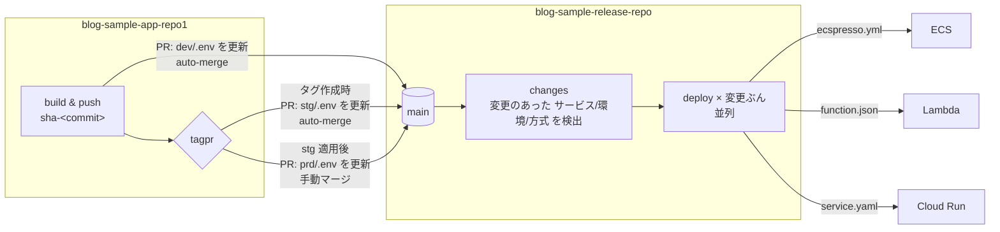

# blog-sample-release-repo

複数のサービスを、それぞれのデプロイ方式 (ECS / Lambda / Cloud Run) で環境ごとにデプロイするためのリリースリポジトリです。
**main にあるものがリリースされているもの**、という状態を保ちます。

- アプリリポジトリは、イメージをビルドしたらこのリポジトリの定義ファイル内のイメージを書き換える PR を作ります。
- この main に入った変更は、変更のあった環境ディレクトリがそのまま適用されます。リリース側は環境の順序付けをしません。
- ワークフローに入力はありません。ロールバックは `git revert` です。

## 考え方

- **パスが宣言**: `<サービス>/<環境>/<方式>/` の 3 階層。第一階層はアプリケーション名 (アプリ側 CI が `APP_NAME` で明示する)、第二階層は環境、第三階層 (`ecs` / `lambda` / `cloudrun`) がデプロイ方式の宣言。`release.yml` は方式ディレクトリの名前で振り分けるだけで、ファイルの有無や独自マニフェストから方式を推測することはしない。
- **環境ディレクトリにはイメージ一覧と定義の実体だけ**: `<サービス>/<環境>/.env` にその環境のイメージを置き、`<サービス>/<環境>/<方式>/` にツールのネイティブな定義ファイルを置く。1 つのサービスが ECS と Lambda の両方を持っても、イメージの更新先は `.env` 1 つ。
- **方式ごとに独立したワークフロー**: `deploy-ecs.yml` / `deploy-lambda.yml` / `deploy-cloudrun.yml`。認証 (AWS OIDC / GCP Workload Identity) もその中に閉じている。
- **イメージは `<サービス>/<環境>/.env` に書いてある**: `IMAGE=registry/repo:tag` の形の行。サイドカーがあれば `IMAGE_NGINX=...` のように行を増やす (変数名は自由)。ecspresso と lambroll は `--envfile` でこれを読み、定義内の `{{ must_env `IMAGE` }}` / `{{ must_env `IMAGE_NGINX` }}` に入る。Cloud Run は `.env` を読み込んでから `service.yaml` を `envsubst` する。方式が違っても「イメージを更新する」操作は `.env` の行の書き換えで済む。
- **イメージの更新はリポジトリ一致で行う**: `scripts/set-image.sh <サービス>/<環境> <image>...` は、渡されたイメージと同じリポジトリ (registry/repository) を値に持つ変数をすべて書き換える。アプリ側 CI は自分がビルドしたイメージを渡すだけでよく、別リポジトリ由来のサイドカーには触れない。該当する変数がなければエラーになる。
- **認証先だけ GitHub Environments に置く**: 環境ごとに 1 つのデプロイ用ロール (AWS) / サービスアカウント (GCP)。OIDC の `sub` 条件を `environment:<env>` に絞れる。
- **どこでも同じイメージ**: dev / stg / prd に同じイメージ (同じダイジェスト) が入る。再ビルドはしない。
- **環境の区別をしない**: main に入った変更を、変更のあったディレクトリぶんだけ並列に適用する。「main マージで dev」「タグが切られたら stg、そのあと prd」といった順序は、アプリ側が **いつ main に入れるか** で表現する (dev とタグ時の stg は auto-merge、prd はタグ時の PR を人がマージ)。環境名は GitHub Environment (認証先、承認ルール) の参照にだけ使う。



## ディレクトリ構成

```
.
├── blog-sample-app/                       # アプリケーション名 (アプリ側 CI が APP_NAME で指定する)
│   ├── dev/
│   │   ├── .env                         # IMAGE=..., IMAGE_NGINX=... (この環境のイメージ一覧)
│   │   └── ecs/                         # ← 方式の宣言
│   │       ├── ecspresso.yml            # ecspresso 設定 (cluster, service, region)
│   │       ├── ecs-task-def.json        # app: {{ must_env `IMAGE` }}, nginx: {{ must_env `IMAGE_NGINX` }}
│   │       └── ecs-service-def.json
│   ├── stg/ …
│   └── prd/ …
├── example-lambda-app/                  # 例
│   ├── dev/{.env, lambda/function.json}
│   └── prd/{.env, lambda/function.json}
├── example-cloudrun-app/                # 例
│   ├── dev/{.env, cloudrun/service.yaml}
│   └── prd/{.env, cloudrun/service.yaml}
├── scripts/
│   ├── set-image.sh                     # .env のイメージを差し替える (アプリ側 CI が呼ぶ。複数可)
│   └── render.sh                        # 定義をツールに読ませて確認 (CI / ローカル)
└── .github/
    ├── CODEOWNERS                       # */prd/ のレビュー必須化
    └── workflows/
        ├── release.yml                  # main push: 変更のあった 方式/サービス/環境 を方式ごとのワークフローへ
        ├── deploy-ecs.yml               # 再利用: ECS (ecspresso, AWS OIDC)
        ├── deploy-lambda.yml            # 再利用: Lambda (lambroll, AWS OIDC)
        ├── deploy-cloudrun.yml          # 再利用: Cloud Run (gcloud, GCP Workload Identity)
        └── ci.yml                       # PR: 全サービス × 全環境の render
```

## リリースの流れ

1. **アプリの main にマージ** → アプリ側 CI がイメージ (app と nginx) を `sha-<commit>` で push し、`scripts/set-image.sh` で `dev/.env` を書き換える PR をこのリポジトリに作って auto-merge する。
2. **この main に入る** → `release.yml` が変更のあった `<サービス>/<環境>/<方式>/` を検出して適用する (dev)。
3. **アプリ側で tagpr のリリース PR をマージ** → タグ (CalVer) が作られる。アプリ側 CI が `stg/.env` をそのタグに書き換える PR を作って auto-merge し、stg への適用成功を待つ。続けて `prd/.env` を書き換える PR を作る。これは auto-merge しない。
4. **prd の PR をマージ** (CODEOWNERS のレビュー) → `release.yml` が prd にデプロイする。これが本番リリース。
5. **戻したいとき** → 該当コミットを `git revert` した PR をマージする。前の image に戻る。

手動で全件を再適用したいときは `Release` ワークフローを `workflow_dispatch` で実行します (引数なし)。

## デプロイ方式ごとの動き

| ディレクトリ | ツール | 認証 | 実行内容 |
|---|---|---|---|
| `<サービス>/<環境>/ecs/` | [ecspresso](https://github.com/kayac/ecspresso) | AWS OIDC | `--envfile .env` で `verify` → `diff` → `deploy` (サービス安定化まで待機。サーキットブレーカーで自動ロールバック) |
| `<サービス>/<環境>/lambda/` | [lambroll](https://github.com/fujiwara/lambroll) | AWS OIDC | `--envfile .env` で `diff` → `deploy` (コンテナイメージ。新バージョンを publish してエイリアスを付け替え) |
| `<サービス>/<環境>/cloudrun/` | gcloud | GCP Workload Identity | `.env` を読んで `envsubst` → `gcloud run services replace` (新リビジョンが Ready になるまで待機) |

方式ごとにワークフローが独立しているので、認証やツールの都合は各ファイルに閉じます。新しい方式を足すときは方式ディレクトリの名前を 1 つ決め、`deploy-<方式>.yml` と `release.yml` の振り分け先を 1 つずつ足します。

## サービスや環境を追加する

- **サービスの追加**: `<サービス>/<環境>/.env` と `<サービス>/<環境>/<方式>/` にツールの定義ファイルを置く PR を出す。GitHub 側の設定変更は不要。
- **環境の追加**: 既存の環境ディレクトリをコピーして値を書き換える。
- **環境を外す**: ディレクトリを消す。

## セットアップ

### クラウド側 (このリポジトリの範囲外)

各サービス・環境のリソース (ECS クラスター、ALB、IAM ロール、Lambda 実行ロール等) は Terraform 等で用意し、その ID や ARN を定義ファイルに書きます。

GitHub Actions 用のデプロイロールは **環境ごとに 1 つ** で、このリポジトリの環境を信頼します。
AWS の OIDC なら `sub` を `repo:gainings/blog-sample-release-repo:environment:<env>` に、GCP の Workload Identity なら属性条件を同様に絞ります。

### GitHub 側

**Environments** `dev` / `stg` / `prd` を作成し、それぞれに variables を設定します。

| 変数 | 用途 |
|---|---|
| `AWS_ROLE_ARN` | ECS / Lambda のデプロイに使うロール |
| `AWS_REGION` | 同上 |
| `GCP_WORKLOAD_IDENTITY_PROVIDER` | Cloud Run を使う場合 |
| `GCP_SERVICE_ACCOUNT` | 同上 |
| `GCP_PROJECT_ID` | 同上 |
| `GCP_REGION` | 同上 |

使わない方式の変数は不要です。`prd` に Required reviewers を設定すると、PR マージ後さらに承認を挟めます。

クラウドを用意せずに流れだけ確認したい場合は、Environment の variable に `DRY_RUN=true` を設定します。認証もデプロイもせず、定義のレンダリングだけを行って成功します (ログとサマリーに DRY RUN と明記されます)。

**ブランチ保護 (main)**: ruleset で PR 必須、squash のみ、必須チェック `ci-ok`、CODEOWNERS (`*/prd/`) の承認必須、バイパスなし。"Allow auto-merge" を有効にしておくと、`Propose release` の auto-merge が `ci-ok` 通過後にマージされます。

**GitHub App**: 3 つの App を役割ごとに分けます。

| App | 権限 | インストール先 | 鍵の置き場所 | 用途 |
|---|---|---|---|---|
| リリース用 (`GH_APP_ID` / `GH_APP_PRIVATE_KEY`) | Contents / Pull requests: Read and write | このリポジトリ | このリポジトリ | `Propose release` が `.env` を書き換えた PR を作る |
| 要求用 | Actions: Read and write | このリポジトリ | 各アプリリポジトリ | アプリ側 CI が `Propose release` を起動する |
| tagpr 用 | Contents / Pull requests: Read and write | 各アプリリポジトリ | 各アプリリポジトリ | アプリ側の tagpr がリリース PR とタグを作る |

このリポジトリの内容を書ける鍵はこのリポジトリにしかなく、アプリリポジトリが持つ鍵ではワークフローの起動しかできません。加えて main の ruleset (PR 必須、`ci-ok` 必須、`*/prd/` は CODEOWNERS の承認必須、バイパスなし) により、鍵が漏れても main へ直接 push はできません。

## ローカルでの確認

```sh
scripts/render.sh blog-sample-app/dev/ecs
scripts/set-image.sh blog-sample-app/dev \
  111111111111.dkr.ecr.ap-northeast-1.amazonaws.com/blog-sample-app:sha-abc123 \
  111111111111.dkr.ecr.ap-northeast-1.amazonaws.com/blog-sample-app-nginx:sha-abc123
git diff   # dev/.env の IMAGE と IMAGE_NGINX が変わる
```

`yq`, `jq`, `ecspresso`, `lambroll` が必要です。クラウドには接続しません。
